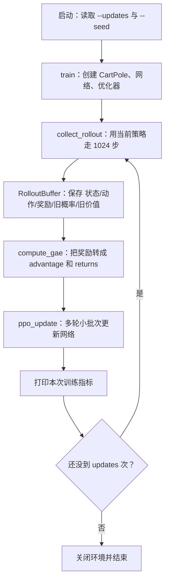

# CartPole PPO：按“整体到逐行”的学习讲解

对应代码：一份约 500 行的 PPO CartPole 训练脚本（本文整理自对该脚本的逐行讲解，脚本本身未随本站发布）。下面的“第 N 行”均指该脚本的行号，不影响按讲解理解逻辑。

空行只用来分隔代码；以 `#` 开头的行是原代码的注释。它们不执行，因此本文重点逐行解释**会执行的语句**，并在必要时说明相邻注释的意思。

## 1. 整体功能：这个程序到底在做什么

它训练一个“智能体”玩 CartPole（倒立摆）游戏：小车上有一根杆，程序每一步只能选择向左或向右推车。杆不倒就持续获得奖励；杆倒下，一局结束。

程序并没有把“杆要倒了就往哪边推”写死。它使用一个神经网络当作决策器，让网络从反复试错中学会：在某个状态下，向左、向右各应该有多大概率。

网络同时做两件事：

- **Actor（演员/策略）**：回答“现在该往左还是往右？各自概率多少？”
- **Critic（评论员/价值估计）**：回答“从现在开始，预计还能拿到多少分？”

PPO 是更新 Actor 的方法。它的性格很谨慎：经验告诉它某个动作好时，确实会提高该动作概率；但它通过 `clip` 限制一次变化幅度，避免策略突然变得完全不同而训练崩溃。

## 2. 整体逻辑：程序从启动到学习的路线图

直接执行文件时，第 533–535 行先读命令行参数，然后调用 `train`。训练中的一个 update 是完整的小循环，流程如下：



把它想成一个学习闭环：

1. **先行动**：网络看状态并随机选动作。
2. **再记账**：保存动作、奖励，以及“行动当时网络的看法”。
3. **事后评估**：根据最终结果判断每个动作比预期好还是坏。
4. **最后学习**：让好动作更容易被选到、坏动作更不容易被选到，同时训练价值预测。

一个必须牢记的规则：**一批经验采集完成后，才更新网络。** 因此经验中保存的 `old_log_probs` 真正代表“旧策略”；更新时重新计算的 `new_log_probs` 才代表“新策略”。PPO 正是比较这两者。

## 3. 独立模块：每一块负责什么

| 模块 | 位置 | 责任 | 产出 |
| --- | --- | --- | --- |
| 配置 `PPOConfig`          | 44–78 行       | 集中保存超参数           | `gamma`、学习率、批量大小等 |
| 网络 `ActorCritic`        | 81–150 行      | 选动作并估计价值         | 动作、对数概率、`V(s)` |
| 经验箱 `RolloutBuffer`    | 153–200 行    | 保存 T 步交互记录         | 训练用的六个张量 |
| 延续状态 `CollectorState` | 203–211 行     | 在两次采集之间续接环境    | observation、累计回报 |
| 采集 `collect_rollout`    | 214–271 行     | 让策略实际玩 T 步        | 一批经验 |
| 评估 `compute_gae`         | 274–325 行   | 由奖励计算优势和价值目标   | `advantages`、`returns` |
| 更新 `ppo_update`         | 328–434 行    | 用 PPO 损失训练网络       | 四个监控指标 |
| 总控 `train`               | 437–511 行  | 按固定顺序协调全部模块      | 控制台日志 |
| 启动参数 `parse_arguments`   | 514–535 行   | 让命令行控制训练次数和种子   | 调用 `train` |

## 4. 程序开头与配置：第 1–78 行

### 4.1 文件说明和导入：第 1–41 行

- **第 1–20 行**：三引号包住的是模块文档字符串。Python 运行时会把它作为这个文件的说明文字保存；其中第 4 行给出运行命令，第 9–16 行说明环境、动作和主流程。
- **第 23 行**：`from __future__ import annotations` 延迟处理类型注解。初学时可以简单理解成：让 `ActorCritic` 这类类型名在文件中使用时更灵活，不影响训练算法。
- **第 26 行**：导入 `argparse`，它把 `--updates 2` 这种命令行文字变成 Python 变量。
- **第 29 行**：导入 `dataclass`。后面两个“主要装数据”的类不用自己手写初始化函数。
- **第 32 行**：`import gymnasium as gym`，把环境库取一个短名称 `gym`。后续 `gym.make(...)` 就是在创建游戏。
- **第 35 行**：导入 PyTorch 主模块，张量、随机数、优化器都从这里取得。
- **第 38 行**：`Tensor` 只是类型标注名称；`nn` 是神经网络工具箱，包含线性层、损失函数等。
- **第 41 行**：导入离散概率分布 `Categorical`。它将两个动作的 logits 转成概率，并据此采样动作。

### 4.2 配置类 `PPOConfig`：第 44–78 行

**功能**：把散落的训练参数收在一个对象里。第 450 行执行 `config = PPOConfig()` 后，所有字段都会取得这里的默认值。

- **第 44 行**：`@dataclass` 装饰器告诉 Python：下面的类主要用于存数据，自动生成形如 `PPOConfig(gamma=0.99, ...)` 的初始化逻辑。
- **第 45 行**：定义类 `PPOConfig`。类本身还没有训练行为，只是参数清单。
- **第 54 行**：`gamma: float = 0.99`。冒号后的 `float` 表示预期类型，等号后是默认值。`gamma` 在第 311、317 行使用，作用是让越远的奖励影响越小。
- **第 57 行**：`gae_lambda: float = 0.95`。它在第 317 行和 `gamma` 一起控制 GAE 对未来 TD 误差的累计程度。
- **第 60 行**：`clip_epsilon: float = 0.20`。它在第 380–381 行把概率比限制到 `[0.8, 1.2]`。
- **第 63 行**：`learning_rate: float = 3e-4`，即 `0.0003`。第 452 行交给 Adam 优化器，规定每一步参数更新的步长。
- **第 66 行**：`rollout_steps: int = 1_024`。每次更新前先收集 1024 个时间步；第 468 行把它传给采集函数。
- **第 69 行**：`update_epochs: int = 4`。同一批 1024 步经验在更新阶段会重复学习四轮，见第 356 行。
- **第 72 行**：`minibatch_size: int = 64`。1024 条经验会以每批最多 64 条的方式传入网络，见第 360 行。
- **第 75 行**：`value_coefficient: float = 0.5`。第 402 行用它降低或提高 Critic 损失对总损失的影响。
- **第 78 行**：`entropy_coefficient: float = 0.01`。第 403 行用它控制“鼓励探索”的强度。

## 5. 独立模块一：ActorCritic 网络，第 81–150 行

### 5.1 这个模块的功能

对于一个输入状态 `s`，它同时输出：

```text
状态 s（4 个数）
       ↓
共享特征网络（4 → 64 → 64）
       ├── policy_head → 2 个 logits → 左/右动作分布
       └── value_head  → 1 个数       → V(s)
```

CartPole 状态的四个数依次是：小车位置、小车速度、杆子角度、杆子角速度。这里不需要死记物理含义；网络会自己学习它们与“该往哪推”之间的关系。

### 5.2 初始化函数 `__init__`：第 91–109 行

- **第 91 行**：定义构造函数。`observation_size` 是输入长度（CartPole 中为 4），`action_size` 是动作数（这里为 2）。`-> None` 表示初始化函数不返回有用结果。
- **第 93 行**：调用父类 `nn.Module` 的初始化。没有这一行，PyTorch 无法正确登记后面创建的神经网络层和参数。
- **第 97 行**：`nn.Sequential(...)` 创建一个按顺序执行的小网络，并把它存到 `self.features`。`self.` 表示“属于这个网络对象”。
- **第 98 行**：`nn.Linear(observation_size, 64)` 是全连接层。若输入是 `[batch, 4]`，输出就是 `[batch, 64]`。它内部有可学习的权重和偏置。
- **第 99 行**：`nn.Tanh()` 应用双曲正切激活函数，将数压到约 `[-1, 1]`。没有激活函数时，多层线性层仍可合并成一层，学习能力会不足。
- **第 100 行**：第二个线性层，把 64 个特征再变成 64 个特征。
- **第 101 行**：第二个 Tanh，为第二层提供非线性。
- **第 102 行**：结束 `Sequential` 的组成列表。
- **第 106 行**：策略头 `policy_head`，把共享的 64 个特征变为 2 个 logits。它的输出例如可能是 `[1.2, -0.3]`，数越大表示该动作越受当前策略偏好，但它们还不是概率。
- **第 109 行**：价值头 `value_head`，把 64 个特征变成一个标量价值。这个值可以是负数或大于 1，因为它是“未来总奖励的估计”，不是概率。

### 5.3 前向传播 `forward`：第 111–125 行

**功能**：一次批量计算 Actor 和 Critic 的原始输出。`model(states)` 会自动调用这个函数。

- **第 111 行**：定义 `forward`。输入 `states` 是张量，返回两个张量。
- **第 119 行**：`features = self.features(states)`。让状态依次通过第 98–101 行的四个层，得到隐藏特征。若输入有 B 个状态，形状为 `[B, 64]`。
- **第 120 行**：策略头读取特征，得到 `action_logits`，形状为 `[B, 2]`。
- **第 124 行**：价值头读取同一份特征，先得到形状 `[B, 1]`；`.squeeze(-1)` 删除最后一维，所以得到 `[B]`。`-1` 意味着“最后一个维度”。
- **第 125 行**：返回一个元组：第一个是 logits，第二个是 values。调用方可以写 `action_logits, values = model(states)` 来拆开它。

### 5.4 动作与价值函数 `get_action_and_value`：第 127–150 行

**功能**：在 `forward` 基础上进一步得到动作和对数概率。这个函数有两种模式：

| 调用位置 | `actions` 参数 | 行为 |
| --- | --- | --- |
| 第 238 行采集经验 | `None` | 按当前概率随机抽取动作 |
| 第 365–367 行训练 | 旧经验动作 | 只计算旧动作在新策略下的概率 |

- **第 127–129 行**：函数签名。`actions: Tensor | None = None` 表示这个参数可以是张量，也可以不传（默认为 `None`）。
- **第 136 行**：调用当前对象的 `forward`，获得 logits 和价值预测。
- **第 140 行**：用 logits 创建 `Categorical` 概率分布。内部会做与 softmax 等价的归一化；例如 logits `[1.2, -0.3]` 会变成两个相加为 1 的概率。
- **第 142 行**：判断调用方是否提供了动作。
- **第 145 行**：只有没提供动作时才执行采样。`distribution.sample()` 产生一个动作编号；批量为 1 时其形状是 `[1]`，值是 0 或 1。
- **第 149 行**：`distribution.log_prob(actions)` 计算所给动作的自然对数概率。若概率为 0.8，结果约为 `log(0.8)`；PPO 后面将新旧对数概率相减，以稳定地求概率比。
- **第 150 行**：返回三个结果：动作、该动作的对数概率、当前状态价值。

## 6. 独立模块二：经验缓存与延续状态，第 153–211 行

### 6.1 `RolloutBuffer`：第 153–200 行

**功能**：保存一次“先走 1024 步、再学习”的完整证据。每个时间步 t 保存以下六项：

| 字段 | 数学符号 | 用途 |
| --- | --- | --- |
| `states` | `s_t` | 告诉网络当时看到了什么 |
| `actions` | `a_t` | 告诉网络当时真正执行了什么 |
| `rewards` | `r_t` | 环境给出的即时反馈 |
| `dones` | 是否结束 | 阻止 GAE 跨局计算 |
| `old_log_probs` | `log π_old(a_t|s_t)` | PPO 概率比的分母证据 |
| `old_values` | `V_old(s_t)` | 计算 GAE 和 value target 的基线 |

#### 初始化：第 160–167 行

- **第 160 行**：定义缓存初始化函数。
- **第 162–167 行**：分别创建六个空列表。写成 `list[Tensor]` 是类型提示；`[]` 才是创建真实空列表的操作。采集时每步追加一项，避免一开始就猜测张量大小。

#### 添加一条经验：第 169–189 行

- **第 169–177 行**：定义 `add` 的输入。它接收单步状态、动作、浮点奖励、结束标记、旧对数概率和旧价值。
- **第 179 行**：将状态 `s_t` 加入 `states` 列表。
- **第 180 行**：将实际执行动作 `a_t` 加入 `actions` 列表。
- **第 181 行**：把 Python 浮点数 `reward` 转成 `float32` 张量再保存。这样之后能与其他 PyTorch 张量直接运算。
- **第 185 行**：`float(done)` 将 `False/True` 转成 `0.0/1.0`，随后封装为张量。GAE 中 `1.0 - done` 因而能直接成为连续或终止的开关。
- **第 188 行**：保存“行为发生时”的旧对数概率。这一行是 PPO 能比较新旧策略的关键证据。
- **第 189 行**：保存采样时旧 Critic 的价值预测。

#### 把列表变成批量张量：第 191–200 行

- **第 191 行**：定义 `tensors`，返回六个张量组成的元组。
- **第 193 行**：开始构造返回元组，元素顺序必须和调用方拆包的顺序一致。
- **第 194 行**：`torch.stack(self.states)` 把 T 个 `[4]` 状态沿新维度堆叠成 `[T, 4]`。
- **第 195 行**：把 T 个标量动作堆叠成 `[T]`。
- **第 196 行**：把 T 个奖励堆叠成 `[T]`。
- **第 197 行**：把 T 个结束标记堆叠成 `[T]`。
- **第 198 行**：把 T 个旧对数概率堆叠成 `[T]`。
- **第 199 行**：把 T 个旧价值堆叠成 `[T]`。
- **第 200 行**：结束返回元组。

### 6.2 `CollectorState`：第 203–211 行

**功能**：rollout 固定收集 1024 步，但一局游戏不一定刚好在第 1024 步结束。这个类保存下一次采集需要接着使用的状态。

- **第 203 行**：使用 `@dataclass` 自动生成存数据所需的初始化函数。
- **第 204 行**：定义 `CollectorState` 类。
- **第 208 行**：字段 `observation`，即上次采集最后抵达的状态。
- **第 211 行**：字段 `episode_return`，即当前尚未结束这一局已经拿到的奖励；默认值为 `0.0`。

## 7. 函数一：收集经验 `collect_rollout`，第 214–271 行

### 7.1 函数功能和输入输出

它让当前策略连续与环境交互 `rollout_steps` 次，输出：

1. `buffer`：T 条经验；
2. 新的 `CollectorState`：下轮从哪里继续；
3. `completed_returns`：本轮采集期间完整结束的游戏得分，用于打印。

### 7.2 逐行解释

- **第 214 行**：`@torch.no_grad()` 装饰器。进入函数期间 PyTorch 不记录求导轨迹，因为采集只是在行动，不是在训练。这样减少内存与计算。
- **第 215–220 行**：定义函数和类型。`environment` 是游戏环境，`model` 是当前网络，`collector_state` 是续接状态，`rollout_steps` 是收集步数。返回类型说明为“缓存、续接状态、浮点列表”。
- **第 226 行**：创建空的 `RolloutBuffer`，开始记录这一次经验。
- **第 227 行**：创建空列表，记录采集期间恰好完成的每一局回报。
- **第 230 行**：读出上一次留下的 observation。第一次调用时它来自第 456 行的环境初始状态。
- **第 231 行**：读出当前局已累计的回报，防止 rollout 从一局中间开始时分数丢失。
- **第 233 行**：循环 `rollout_steps` 次。变量 `_` 代表“循环计数不需要使用”。
- **第 235 行**：单个状态形状为 `[4]`；`.unsqueeze(0)` 在最前面加一个长度为 1 的批维度，得到 `[1, 4]`，以符合网络的批量输入格式。
- **第 238 行**：调用网络并得到三个结果。由于没有传 `actions`，函数会采样动作；此时的 `old_log_prob`、`old_value` 是**更新前**网络产生的值。
- **第 241 行**：把 `action.item()` 得到的 Python 整数传给环境。环境返回：下一状态、奖励、正常结束标志、截断结束标志、额外信息。最后一个信息这里不用，所以用 `_` 接收。
- **第 246 行**：只要 `terminated` 或 `truncated` 任一为真，`done` 就为真。PPO 的这份教学实现把两种结束都视为不能继续 bootstrap 的终点。
- **第 249 行**：开始把当前这一步交给 buffer。
- **第 250 行**：存当前状态，而不是下一状态；这符合经验 `(s_t, a_t, r_t)` 的定义。
- **第 251 行**：动作原本形状 `[1]`，去掉批维后再保存。
- **第 252 行**：存环境刚给的即时奖励。
- **第 253 行**：存这一动作之后是否结束。
- **第 254 行**：存旧策略对该动作的对数概率，去掉批维。
- **第 255 行**：存旧 Critic 的当前状态价值，去掉批维。
- **第 256 行**：结束本次 `buffer.add` 调用。
- **第 259 行**：把本步奖励加入当前局总分。
- **第 261 行**：如果这局结束，进入分支。
- **第 263 行**：把完整一局的总回报加到列表。不要把它和训练用的逐步 `rewards` 混淆；它仅用于观察训练效果。
- **第 264 行**：重置环境，开始新一局；`reset` 的第二返回值是额外信息，故忽略。
- **第 265 行**：新一局的累计回报归零。
- **第 268 行**：不管是否结束，都把下一状态转换成 `float32` PyTorch 张量，供下一个循环作为 `observation`。
- **第 271 行**：返回三项。`CollectorState(observation, episode_return)` 把最后状态和未完成局的分数打包，供下一次 rollout 使用。

## 8. 函数二：计算 GAE 的 `compute_gae`，第 274–325 行

### 8.1 这个函数想解决的问题

奖励 `reward=1` 只说明“这一步杆还没倒”，却没有直接说明刚才选择向左是否比向右更好。Critic 原先对未来有预测 `V(s_t)`；GAE 用实际结果修正它，形成：

```text
advantage A_t > 0：结果比 Critic 预期好 → 增加动作 a_t 的概率
advantage A_t < 0：结果比 Critic 预期差 → 降低动作 a_t 的概率
returns_t：给 Critic 学习的目标值
```

本函数使用的核心式子为：

```text
TD 误差：δ_t = r_t + γ × V(s_{t+1}) × (1 - done_t) - V(s_t)
GAE：    A_t = δ_t + γ × λ × (1 - done_t) × A_{t+1}
目标：   return_t = A_t + V(s_t)
```

### 8.2 逐行解释

- **第 274 行**：同样禁用梯度。本函数只根据旧数据算训练标签，不更新模型参数。
- **第 275–282 行**：函数输入分别是奖励、结束标记、旧价值、rollout 最后状态、模型和配置；输出是优势与回报两个 `[T]` 张量。
- **第 293 行**：rollout 最后可能没结束，故将最后 observation 加上 batch 维，送入模型得到 `last_value`。左侧 `_` 忽略 logits，只要价值预测。
- **第 296 行**：新建全 0 张量 `advantages`，形状与 `rewards` 相同，即 `[T]`。
- **第 299 行**：初始化递推变量 `gae` 为 0。倒序循环一开始，它扮演不存在的 `A_{T}`。
- **第 300 行**：把 `[1]` 的 `last_value` 压成标量，作为最后一步的 `next_value = V(s_T)`。
- **第 303 行**：从 `T-1` 倒数到 0。倒序是因为第 t 步 GAE 要使用第 t+1 步刚算好的 GAE。
- **第 305 行**：若 `dones[t]=0`，`non_terminal=1`，可以连接下一状态价值；若 `dones[t]=1`，它为 0，切断跨局计算。
- **第 309–313 行**：按上面的 TD 公式计算 `td_error`。第 310 行取即时奖励；第 311 行加入折扣后的下一状态价值；第 312 行减去旧 Critic 对当前状态的预测。
- **第 317 行**：按 GAE 递推式计算当前 `gae`。当本步终止时 `non_terminal=0`，未来的 `gae` 不再传回来。
- **第 318 行**：将当前时间步的优势写进正确位置。虽然计算顺序是倒着走，数组下标仍是原本时间顺序。
- **第 321 行**：继续向前处理时，当前的旧价值就成了前一步所需的“下一状态价值”。
- **第 324 行**：根据 `returns = advantages + values` 形成 Critic 的监督目标。若实际结果比预期高，优势为正，目标会比旧 `values` 高。
- **第 325 行**：把两个训练信号返回给 `train`。

## 9. 函数三：PPO 更新 `ppo_update`，第 328–434 行

### 9.1 函数功能：如何让网络从经验中学习

这段是 PPO 的核心。它固定先前采集的一批经验，然后重复做小批次梯度下降。Actor 的目标可概括为：

```text
ratio = π_new(a|s) / π_old(a|s)
actor 目标 = min(ratio × advantage, clip(ratio, 0.8, 1.2) × advantage)
```

这里不能简单地说“ratio 大就好”：当 advantage 为负时，应该降低坏动作概率。`min(...)` 与 clip 的组合正是 PPO 对两种情况都安全的保守规则。

### 9.2 逐行解释：准备数据，第 328–354 行

- **第 328–335 行**：定义更新函数。除了模型和优化器外，输入还有固定的经验、GAE 结果、价值目标和配置；返回四个用于记录的浮点数。
- **第 342 行**：从 buffer 中取出 six tensors。`_` 表示当前位置的张量不用；这里真正需要 `states`、`actions`、`old_log_probs`。`returns` 已作为参数传入，GAE 已消耗奖励、done 和旧价值。
- **第 346 行**：优势标准化。先减均值使平均值为 0，再除标准差使波动尺度约为 1。`1e-8` 防止标准差为 0 时除零。它提升数值稳定性，但不改变“优势正/负”的方向。
- **第 349–352 行**：创建四个空列表，用于记录每个 mini-batch 的指标。
- **第 353 行**：`len(states)` 是本批经验数量 T，即默认 1024。

### 9.3 逐行解释：分轮、打乱、切小批次，第 355–367 行

- **第 356 行**：外层循环重复 `update_epochs` 次，默认 4 次。每轮都学习同一批固定经验。
- **第 357 行**：`torch.randperm(sample_count)` 生成 `0..T-1` 的随机排列。打乱顺序避免模型总按时间相邻的样本更新。
- **第 360 行**：`range(0, T, 64)` 依次产生 `0, 64, 128, ...`，每一个值是一个小批次的起点。
- **第 361 行**：从打乱索引中切出本 mini-batch 的索引，最后一批允许小于 64。
- **第 365–367 行**：将本批状态和**已记录的旧动作**传给模型。模型不采新动作，而是计算这些固定旧动作在“当前参数”下的新对数概率和新价值。

### 9.4 逐行解释：PPO 的 ratio 与 clip，第 369–387 行

- **第 372 行**：`new_log_probs - old_log_probs[...]` 是 `log(p_new) - log(p_old)`；`torch.exp(...)` 变成 `p_new / p_old`，即概率比 `ratio`。这一步将“策略相对旧策略变化了多少”量化出来。
- **第 375 行**：没有 PPO 保护时的普通策略梯度目标：`ratio × advantage`。
- **第 379–382 行**：`.clamp(下界, 上界)` 把每个 ratio 截到 `[1-epsilon, 1+epsilon]`。默认就是 `[0.8, 1.2]`。例如 ratio 为 1.5 时会被改成 1.2；0.5 时会被改成 0.8。
- **第 383 行**：构造使用截断 ratio 的保守目标。
- **第 387 行**：对每条经验取 `unclipped_objective` 和 `clipped_objective` 中较小者；再取平均并加负号。负号的原因是 PyTorch 的优化器只会最小化 loss，而我们原本希望最大化策略目标。

一个直观例子：若动作结果很好，`advantage=2`，ratio 从 1 上升到 1.5，普通目标会变成 `3`，鼓励进一步大幅提高该动作概率；PPO 会将 ratio 视作 1.2，保守目标最高只按 `2.4` 计算，因此超出阈值后不再奖励“推得更猛”。

### 9.5 逐行解释：Critic、熵与总损失，第 389–404 行

- **第 390 行**：`mse_loss(new_values, returns[batch_indices])` 计算均方误差，让新 Critic 价值预测向 GAE 得到的目标靠近。
- **第 393 行**：再次调用 `model` 得到完整的两个动作 logits；前一步只得到 `new_log_probs` 和 `new_values`，这里需要整个分布来算熵。
- **第 394 行**：`Categorical(...).entropy()` 算每条经验的动作分布熵；`.mean()` 得到批量平均值。动作概率越平均，熵越高，代表策略探索更多。
- **第 400–404 行**：组合总损失。第一项训练 Actor；第二项（乘 0.5）训练 Critic；第三项减去熵，因为最小化总损失时，减去一项等同于最大化熵、鼓励探索。

### 9.6 逐行解释：反向传播与记录指标，第 406–434 行

- **第 408 行**：清空之前 mini-batch 留在参数上的梯度。PyTorch 默认会累加梯度，因此每次更新前都必须清空。
- **第 410 行**：从 `total_loss` 反向传播，计算所有网络参数应当向哪个方向调整。此时只计算梯度，还未改变参数。
- **第 412 行**：限制全部参数梯度的总范数不超过 0.5，防止少数异常样本使更新过大。
- **第 413 行**：Adam 根据第 410 行计算的梯度，真正修改模型参数。到此“新策略”才发生改变。
- **第 416 行**：将本 mini-batch 的策略损失转为普通 Python 数并记录。
- **第 417 行**：同理记录价值损失。
- **第 418 行**：记录本批样本平均 ratio；它在训练初期或每轮开始时通常接近 1。
- **第 421–426 行**：计算超出 clip 区间的样本比例。`sub(1.0).abs() > epsilon` 等价于判断 ratio 是否在 `[0.8, 1.2]` 外；`float().mean()` 将真假值转为 0/1 后求比例。
- **第 429–434 行**：对所有 mini-batch 的四类记录取平均，并作为函数返回值。这里的数只用来显示训练情况，不再参与梯度计算。

## 10. 函数四：总控训练 `train`，第 437–511 行

### 10.1 函数功能

`train` 不直接实现 PPO 公式；它负责按正确顺序调用其他模块，并准备它们所需的对象。它是整个程序的“指挥者”。

### 10.2 逐行解释：初始化，第 437–460 行

- **第 437 行**：定义训练函数。`update_count` 是外层闭环次数；`seed` 用于控制随机性。
- **第 440 行**：设置 PyTorch 随机种子。相同环境与依赖版本下，这会让网络初始化、动作采样、随机打乱更接近可复现。
- **第 443 行**：创建名为 `CartPole-v1` 的 Gym 环境。没有设置 `render_mode`，所以不会出现动画窗口。
- **第 444 行**：重置环境并取到第一个 observation；第二返回值是额外信息，故用 `_` 忽略。把同样的种子给环境，尽量固定环境内部的随机性。
- **第 447 行**：从环境描述中取得观测长度。CartPole 是 4，但代码没有硬编码这个数。
- **第 448 行**：从环境描述中取得动作数。CartPole 是 2。
- **第 450 行**：按默认参数创建配置对象。
- **第 451 行**：创建 ActorCritic 网络，并将环境读到的输入/输出大小传入。
- **第 452 行**：创建 Adam 优化器。`model.parameters()` 交给它所有可学习权重；学习率取配置中的 `0.0003`。
- **第 455–457 行**：创建采集续接状态。将环境初始 observation 从 Numpy 数组转为 `float32` Tensor。
- **第 460 行**：创建最近回报列表，供滑动平均使用。

### 10.3 逐行解释：训练闭环，第 462–490 行

- **第 463 行**：循环从 1 到 `update_count`（包含末尾）。例如 `--updates 2` 时运行第 1 和第 2 次 update。
- **第 464–469 行**：采集一批新经验。返回的 `collector_state` 覆盖旧变量，确保下一轮从正确状态继续。
- **第 472 行**：从 buffer 拆出 GAE 所需数据。`states/actions/old_log_probs` 在这一行不需要，因此用 `_` 占位。
- **第 473–480 行**：计算优势与价值目标；注意传入的是 `old_values`，即采样时 Critic 的基线，而非已经更新后的值。
- **第 483–490 行**：执行 PPO 更新。函数会在同一批经验上进行多轮 mini-batch 训练，并返回监控数值。

### 10.4 逐行解释：统计、输出与关闭，第 492–511 行

- **第 493 行**：把这次采集期间完成的所有 episode 总分加入历史列表。
- **第 494 行**：只保留最后 20 个元素。负索引切片 `[-20:]` 表示“从倒数第 20 个直到结尾”。
- **第 495–497 行**：如果已有完整结束的 episode，计算最近 20 局平均分；否则显示 0.0，避免空列表除零。
- **第 500–508 行**：打印一行格式化日志。`03d` 表示整数至少三位（如 `001`）；`6.1f` 表示宽度至少 6、保留一位小数；这些只影响显示，不影响训练。
- **第 511 行**：训练循环结束后关闭环境，释放资源。

## 11. 启动模块：命令行参数与入口，第 514–535 行

### 11.1 `parse_arguments`：第 514–529 行

- **第 514 行**：定义读取命令行参数的函数，返回 `argparse.Namespace` 对象。
- **第 516 行**：创建参数解析器，并给命令行帮助信息设置描述。
- **第 517–522 行**：定义 `--updates` 参数。用户写 `--updates 2` 时，解析后 `arguments.updates` 为整数 `2`；省略时默认是 30。
- **第 523–528 行**：定义 `--seed` 参数。用户未传时默认为 42。
- **第 529 行**：真正解析命令行文字并返回结果。

### 11.2 文件入口：第 532–535 行

- **第 533 行**：`__name__ == "__main__"` 只在“直接运行这个文件”时为真。如果另一个 Python 文件使用 `import` 导入它，训练不会自动开始。
- **第 534 行**：读取命令行参数并保存到 `arguments`。
- **第 535 行**：把两个参数传给 `train`，整个 PPO 训练流程从这里启动。

## 12. 最后把所有数据流连起来

一次时间步在不同模块之间传递的数据可以记成：

```text
environment 给 observation s_t
    ↓
ActorCritic 给 action a_t、old_log_prob、old_value
    ↓
environment.step(a_t) 给 reward r_t、next_observation、done
    ↓
RolloutBuffer 保存 (s_t, a_t, r_t, done, old_log_prob, old_value)
    ↓  收集满 T 步
compute_gae 给 advantages A_t 和 returns_t
    ↓
ppo_update 用 old_log_prob 与 new_log_prob 计算 ratio，更新网络
```

初学时，优先确认这四个问题：

1. **网络拿什么做输入？** 状态 `s_t`。
2. **网络输出什么？** 动作分布和价值 `V(s_t)`。
3. **训练标签从哪来？** 环境奖励经过 GAE 变成 `advantages` 与 `returns`。
4. **PPO 特别之处是什么？** 以旧策略概率为参照，用 `ratio` 比较新旧策略，再用 `clip` 限制更新幅度。

理解这条链以后，再回看第 372–387 行的 PPO 核心公式，会比一开始直接背公式容易得多。
